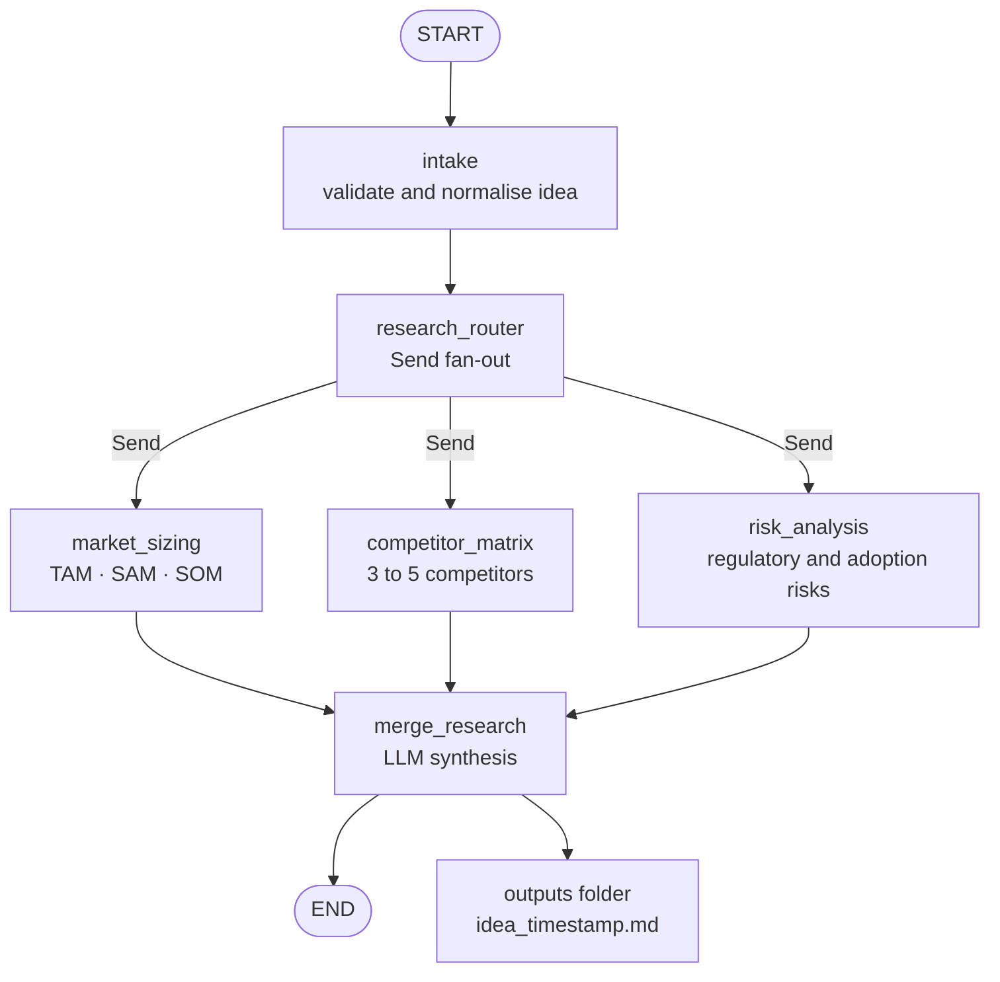
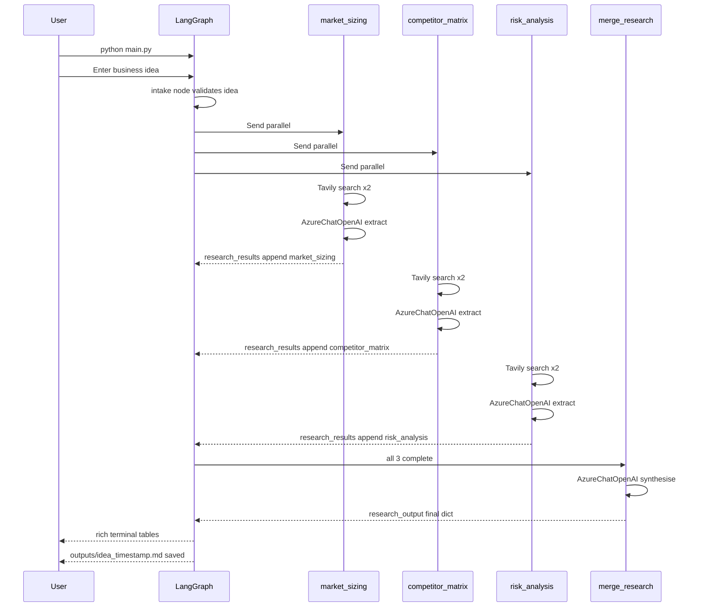
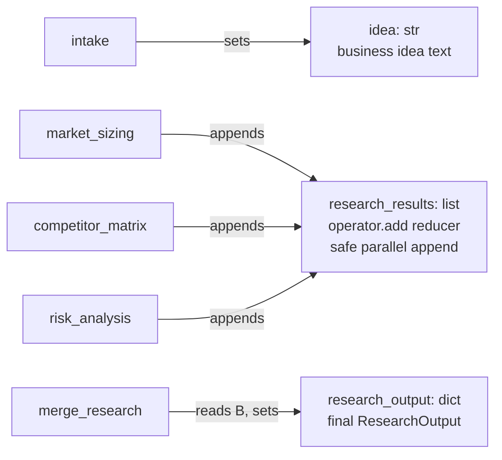
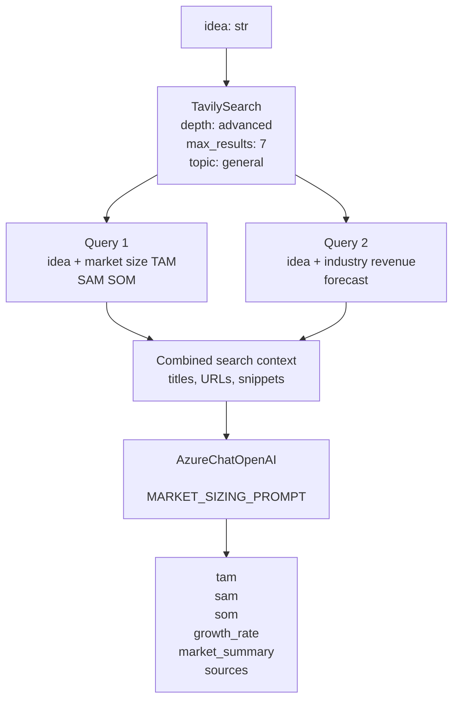
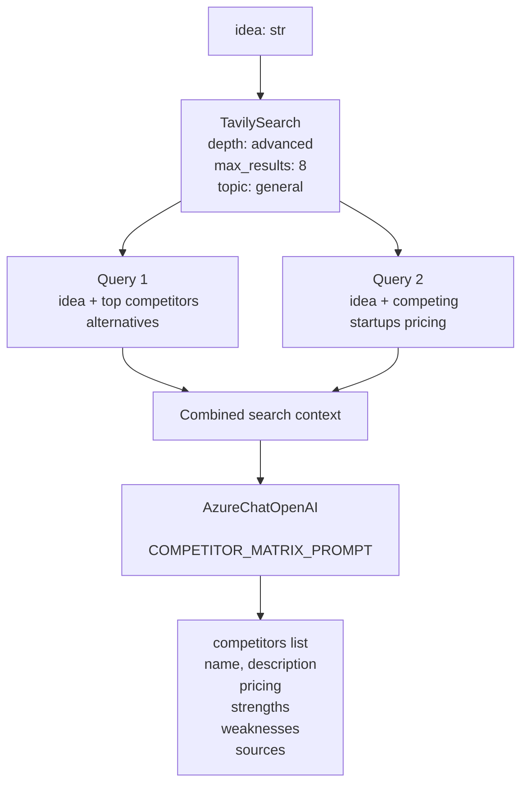
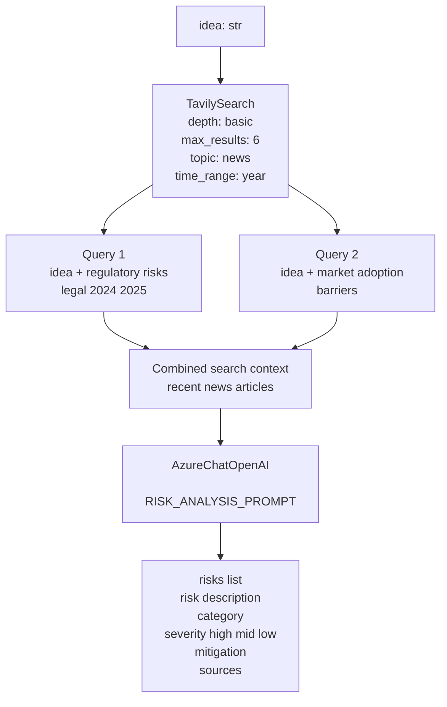
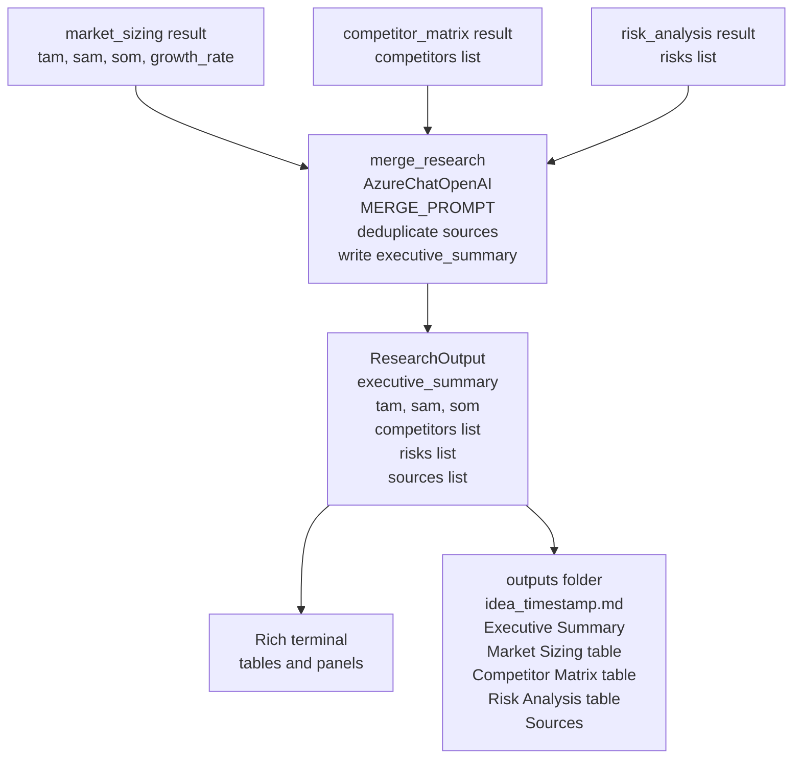
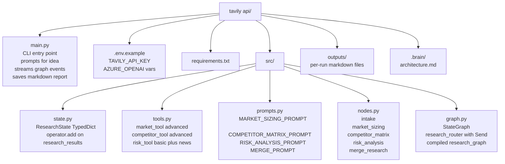

# I2M Research Agent — Architecture & Flow

> Tavily API POC · Research Agent (Agent 01) of the Idea-to-Market Engine

---

## 1. High-Level Graph Topology

---

## 2. Parallel Execution Sequence

---

## 3. State Flow Through the Graph

---

## 4. market_sizing Node Detail

---

## 5. competitor_matrix Node Detail

---

## 6. risk_analysis Node Detail

---

## 7. merge_research and Output

---

## 8. Project File Structure

